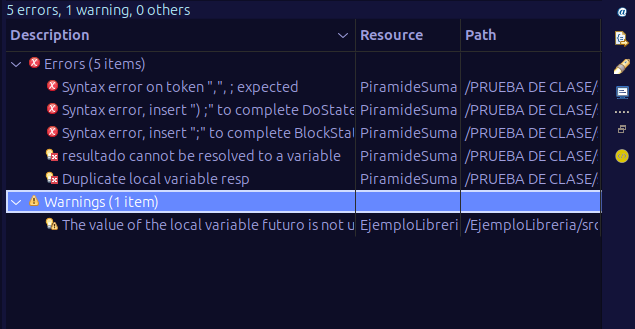
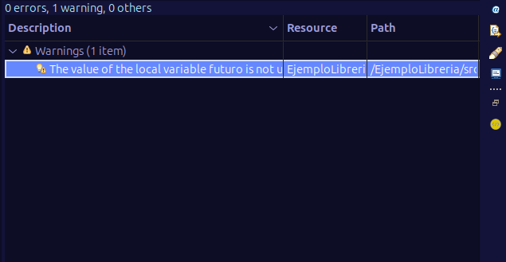
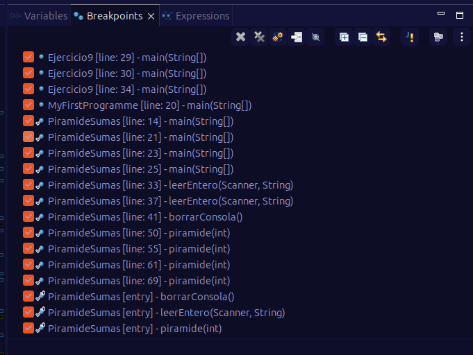
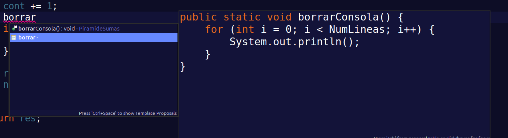

# PRUEBA DE CLASE: 
## RA1 y RA2 aplicadas a una práctica en Eclipse.

*~ Álvaro Pérez*

----

### 2.1 Crear proyecto, paquete e importar la clase (sin explicar)

**CLASE IMPORTADA**

### 2.2 Corregir errores sintácticos (y documentarlos)

- **¿Qué es un error sintáctico?**

Un error sintáctico es un error de escritura del código. Por ejemplo, olvidarse de un ; al final de una sentencia.

- **¿Cuándo los visualizamos?**

En el momento que el IDE los marca con un `x` en rojo

- **¿Podemos depurar con errores de sintaxis?**

NO, no podemos son errores que hay que arreglar para depurar de forma correcta.

La vista problems antes y después:

---

### 2.3 Corregir errores lógicos usando el Depurador

Para realizar la depuración de un programa hay que detenerse sentencia por sentencia y analizar profundamente estableciendo `BREAKPOINTS` 

Para solucionar por ejemplo que no se veai la piramide se pone ciertos breakpoints cerca de ella y ves paso a paso que el problema era que no entraba en el bucle por la condición que tenía.

Usamos **Step Into (F5)** cuando queremos entrar dentro de una función o procedimiento para ver su ejecución paso a paso; **Step Over (F6)** cuando queremos ejecutar una línea completa sin entrar en las funciones que contenga; **Step Return (F7)** para continuar la ejecución hasta salir de la función actual y volver al nivel anterior; y **Resume (F8)** para reanudar la ejecución normal del programa hasta el siguiente punto de interrupción o hasta que termine.

---

### 2.4 Refactorización: renombrar `num` → `numero`

Para refacotorizar `Click Derecho` → `Refactor` → `Rename` o más facil `Shift + Alt + R`

----

### 2.5 Crear una plantilla (template) “borrar”

Esta plantilla nos ayuda a **"borrar la consola"** a traves de una variable `NumLineas` que nos deja poner cuantos saltos de lineas en blaco queremos imprimir.